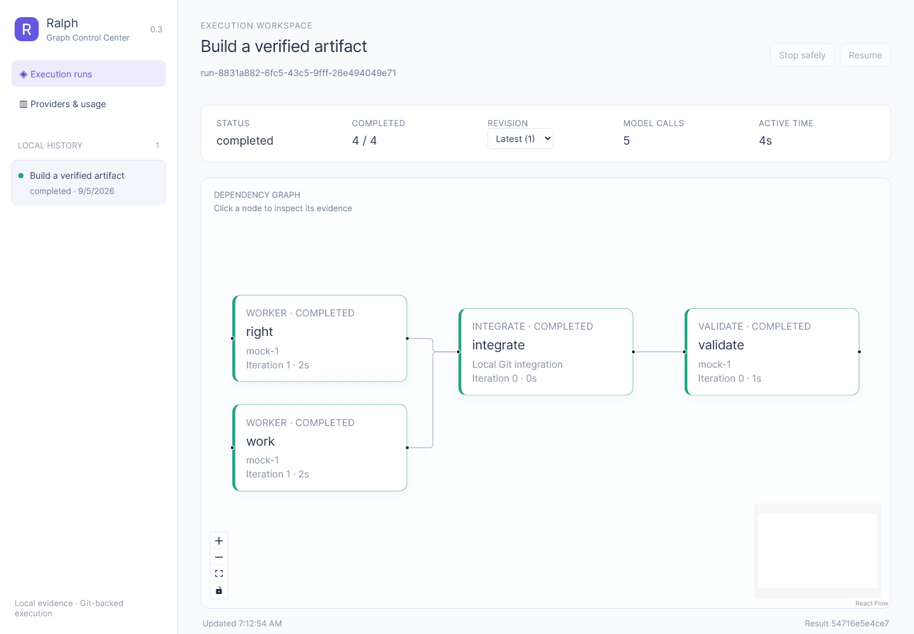
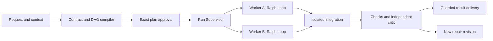

# Ralph

[English](README.md) · [한국어](README.ko.md)

**격리된 Ralph Loop와 검증 가능한 Git 결과를 제공하는 로컬 그래프 에이전트 실행 도구입니다.**



  [](https://github.com/worldclasscitizen/Ralph/actions/workflows/ci.yml) [](LICENSE)

## 빠른 시작

Ralph 0.3.0은 Node.js 22 또는 24와 Git을 사용합니다. 게시된 릴리스를 설치합니다.

```bash
npm install -g @worldclasscitizen/ralph@0.3.0
cd /absolute/path/to/a/clean/git-project
ralph init
ralph doctor
ralph plan "Create a small feature and verify it" --json
```

반환된 그래프·계약·공급자 후보·예산을 검토합니다. 반환값의 `runId`로 같은 저장 계획을 승인합니다.

```bash
ralph run --plan <run-id> --yes
ralph graph show <run-id> --format mermaid
ralph dashboard --open
```

계획 JSON을 파일로 저장한다면 대상 작업 트리 밖에 둡니다. 검토한 JSON은 `ralph run --plan-stdin --yes`로 전달할 수도 있습니다. 처음 보는 요청에 바로 `--yes`를 붙이면 거부합니다. [첫 실행](docs/getting-started.md)

## Loop와 Graph

| 구분 | v0.2 | v0.3 |
|---|---|---|
| 이력 | 순차 Loop 실행 | 하나의 Run, 그래프 리비전과 노드 세대 |
| 작업 공간 | 공유 체크아웃 | 쓰기 노드마다 별도 worktree |
| 스케줄링 | 역할 순차 실행 | 의존성이 준비된 작업의 제한된 병렬 실행 |
| 개선 | 전체 반복 | 노드 내부 Loop, 논리 작업당 최대 6회 |
| 복구 | Loop 체크포인트 | 해시 연결 이벤트·증거·커밋 영수증 |
| 결과 | Worker 체크포인트 | 독립 최종 검증과 보호된 Git 반영 |

## 아키텍처



각 리비전은 DAG입니다. Worker 반복은 노드 내부에서 처리하며, 수정 실행은 새 리비전으로 기록하고 이전 증거를 보존합니다. 모델은 작업을 제안하고 TypeScript는 범위·스케줄링·예산·완료를 통제합니다. [아키텍처](docs/architecture/index.md)

## 공급자

CLI 로그인과 API 키 연결은 별개입니다. 사용하는 연결만 설정합니다. DeepSeek와 GLM만으로 계획·작업·평가 경로를 구성할 수 있으며 Codex를 필수로 요구하지 않습니다.

```bash
ralph providers detect
ralph providers list
ralph auth status
ralph config refresh
```

<!-- provider-verification:start -->
| Connection / model | Support | Verified environment |
|---|---|---|
| Codex | compatible | Live release verification pending |
| Claude Code, Gemini CLI | compatible | Protocol tests; no current live verification |
| OpenAI, Anthropic, Gemini, DeepSeek, GLM APIs | compatible | Protocol tests; no current live verification |
| Antigravity | experimental | Requires a working automation interface |
| Other compatible endpoints | compatible | No live verification |
<!-- provider-verification:end -->

설치·로그인·mock 테스트만으로 실제 공급자 검증을 완료했다고 표시하지 않습니다. 미제공 사용량은 알 수 없음으로 남기고 Hard Pin은 자동 교체하지 않습니다. [설정과 지원 증거](docs/providers/index.md)

## 승인·중단·재개

```bash
ralph stop <run-id>
ralph resume <run-id>
ralph explain <run-id> --node work
ralph respond <run-id> --request <question-id> --stdin
```

필수 응답을 시간 경과로 추정하지 않습니다. 비대화형 입력 대기는 종료 코드 10을 사용합니다. 시작 브랜치나 사용자 파일이 바뀌면 결과를 `ralph/result-<run-id>`에 보존합니다. T3 작업은 최종 확인이 필요합니다. 자동 push와 배포는 수행하지 않습니다.

## 대시보드

패키지에 포함된 React 대시보드는 Run 단위 이력, ELK 그래프, 리비전 선택, 모델·반복 표시, 증거 Inspector, 호출 분포와 작업군별 호출 수를 제공합니다. SSE는 이벤트 순번으로 이어받고 제어 명령에는 로컬 토큰과 일치하는 Origin이 필요합니다. [대시보드와 API](docs/dashboard/index.md)

## 현재 상태와 제한

Ralph는 프로젝트마다 로컬 Supervisor 하나를 실행합니다. Worktree는 변경 격리 수단이며 보안 샌드박스는 아닙니다. 공급자 CLI의 권한 체계는 그대로 적용됩니다. 종료를 확인하지 못한 프로세스와 중간 Worker의 의존 입력 충돌은 점검을 위해 중단합니다. 최종 통합 충돌이나 최종 검증 실패에는 한도가 있는 repair 리비전을 생성합니다. Worker의 컨텍스트 초과는 계약을 유지한 증거 요약으로 재시도하며, 다른 역할에 안전한 축약 입력이 없으면 대기합니다.

원격 실행, 자유 조건식 그래프, 사용량을 모르는 연결의 금액 상한, 모든 충돌의 자동 해결은 0.3.0에서 제공하지 않습니다. 게시 전 [출시 게이트](docs/project/v0.3-readiness.md)를 통과해야 합니다.

## 문서와 기여

- [시작 안내](START_HERE.md)
- [아키텍처](docs/architecture/index.md)
- [공급자](docs/providers/index.md)
- [대시보드](docs/dashboard/index.md)
- [v0.2 전환](docs/migration/v0.3.md)
- [CLI 명령](docs/reference/cli.md)
- [출시 준비 상태](docs/project/v0.3-readiness.md)

릴리스 전 `npm run build`, `npm test`, `npm run test:coverage`, `npm run test:e2e`, `npm run docs:check`, `npm run docs:build`, `npm run smoke`를 실행합니다. 증거를 보존하고 측정하지 않은 성능 개선을 주장하지 않습니다.
