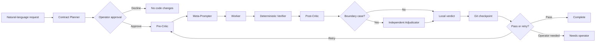

<p align="right">
  <strong>English</strong> | <a href="./README.ko.md">한국어</a>
</p>

<div align="center">
  <h1>Ralph</h1>
  <p><strong>Evidence-first, platform-neutral multi-agent orchestration for software delivery.</strong></p>
  <p>
    Turn one natural-language request into an approved task contract, route each role to the right model,
    verify every iteration, and preserve every outcome as recoverable Git history.
  </p>
  <p>
    <a href="#quick-start"><strong>Quick start</strong></a> ·
    <a href="#how-ralph-works">How it works</a> ·
    <a href="#command-reference">Commands</a> ·
    <a href="#ralph-control-center">Dashboard</a> ·
    <a href="./docs/ARCHITECTURE.md">Architecture</a>
  </p>
  <p>
    
    <a href="https://github.com/worldclasscitizen/ralph/actions/workflows/ci.yml"></a>
    
    
    <a href="./LICENSE"></a>
  </p>
</div>

> [!IMPORTANT]
> **Beta source status:** `v0.1.0-beta.0` is implemented and locally tested, but it has not been published to the npm registry yet. Install it from source today. The `@beta` registry commands below become available after the first npm publication.

## Why Ralph?

Most autonomous coding loops repeatedly call one model and hope the next attempt is better. Ralph makes the loop explicit, inspectable, and recoverable.

| Typical failure | Ralph's answer |
| :--- | :--- |
| A lightweight model implicitly directs every stronger model | A deterministic TypeScript state machine owns orchestration; models only perform bounded roles. |
| The agent edits code before the task is understood | A `TaskContract`, verification plan, and model route must be shown and explicitly approved first. |
| Retries repeat the same mistake | The Meta-Prompter converts Critic and verifier evidence into the next bounded instruction. |
| A self-evaluating Worker passes its own work | Deterministic checks and a stateless Post-Critic evaluate the result; another provider is preferred. |
| A runaway loop leaves an unrecoverable working tree | Every completed, failed, or interrupted iteration attempts a local Git checkpoint. |
| Progress lives only in an LLM context window | Files, verifier output, append-only events, and Git history are the source of truth. |
| Model routing requires hand-written chains | `ralph init` detects usable connections and builds task-aware fallback chains from a signed catalog. |
| Operators can only stare at a terminal marked “running” | The local Control Center streams node state, evidence, Git changes, usage, and safe-stop controls. |

## What makes it different?

<table>
  <tr>
    <td align="left" width="33%"><strong>Contract before code</strong><br>Ralph converts intent into scope, exclusions, acceptance criteria, artifacts, and verifier commands before any write is allowed.</td>
    <td align="center" width="34%"><strong>Evidence before confidence</strong><br>Critics return anchored rubric evidence. Ralph computes scores and hard gates locally instead of trusting a free-form verdict.</td>
    <td align="right" width="33%"><strong>Git before regret</strong><br>Iteration checkpoints, safe interruption, and explicit recovery keep autonomous work reversible without automatic rollback or push.</td>
  </tr>
</table>

- **Platform-neutral control plane:** run Ralph from a normal terminal, IDE terminal, tmux, cmux, or orca. Optional agent Skills call the same CLI.
- **Multi-provider by design:** use stored Codex, Claude Code, Antigravity, or Gemini CLI logins alongside API connections.
- **Role-aware orchestration:** Contract Planner, Critic, Meta-Prompter, Worker, Verifier, and Adjudicator are routed independently.
- **Task-aware routing:** planning, visual frontend, backend, TDD/debugging, static review, and delivery evidence receive different model chains.
- **Bounded tools:** API Workers can inspect and edit project files, inspect Git, and run registered verifiers—but cannot push, deploy, or execute arbitrary shell commands.
- **Local observability:** project evidence stays under Git's internal Ralph path and is shown through CLI or the local dashboard.
- **Honest capacity reporting:** exact official subscription percentages or API balances are shown only when a structured provider interface exists.

## Quick start

### Requirements

- Node.js 22 or newer
- Git
- A Git repository with a clean working tree
- At least one supported authenticated CLI or API connection

### Install from npm after the beta is published

```bash
npm install -g @worldclasscitizen/ralph@beta
ralph --version
```

Run once without a global install:

```bash
npx @worldclasscitizen/ralph@beta run --project /absolute/path/to/project "Improve login accessibility and add tests"
```

### Install from source now

```bash
git clone https://github.com/worldclasscitizen/ralph.git
cd ralph
npm ci
npm run build
npm install -g .
ralph --version
```

For active development, `npm link` is also supported.

### Initialize and run

```bash
cd /absolute/path/to/git-project
ralph init
ralph doctor
ralph run "Improve login accessibility and add tests"
```

Ralph will:

1. Detect available providers and authentication.
2. Generate task and role fallback routes without asking an LLM to rank models.
3. Draft a structured task contract from your request.
4. Show the scope, exclusions, checks, execution profile, and selected route.
5. Wait for explicit approval.
6. Execute and evaluate the loop only after approval.

Nothing is written outside a Git project. From another directory, pass an absolute path:

```bash
ralph run --project /absolute/path/to/project "Refactor the cache layer"
```

## How Ralph works



The TypeScript state machine—not Gemini Flash or any other model—is the operator. The Meta-Prompter may refine the next instruction from evidence, but it cannot expand the approved contract. Meta-Prompter and Worker sessions can continue by exact session ID; Critics remain stateless to reduce anchoring.

### Evaluation and stopping

- Common rubric: 40 points
- Task-specific rubric: 60 points
- Default pass threshold: 85
- Success requires both deterministic verifier success and Post-Critic acceptance
- Boundary adjudication runs only for scores from 80 to 90 or unclear hard gates
- Maximum iterations: 6
- A first-iteration pass ends immediately; six iterations are not mandatory
- Repeated identical failures or stagnant scores transition to `needs_operator`

Critics return item-level anchors and evidence. Ralph calculates totals, hard gates, and the final state locally. See [the architecture guide](./docs/ARCHITECTURE.md) for session and evidence rules.

## Task-aware routing

| Task type | Optimized for |
| :--- | :--- |
| `planning_architecture` | Requirements, trade-offs, system boundaries, and architecture decisions |
| `frontend_visual` | UI implementation, multimodal inspection, responsive behavior, and accessibility |
| `backend_core` | APIs, data models, security boundaries, and core business logic |
| `tdd_debugging` | Reproduction, tests, root-cause isolation, and regression prevention |
| `static_review` | Lint, type analysis, security review, and maintainability findings |
| `delivery_evidence` | Screenshots, technical evidence, impact narratives, and submission readiness |

### Execution profiles

| Profile | Priority | Typical use |
| :--- | :--- | :--- |
| `balanced` | Fit, reliability, provider diversity, then cost and speed | Default for most work |
| `quality` | Highest task fit and reliability | Architecture, risky refactors, final review |
| `fast` | Low latency with adequate task fit | Time-boxed work and quick iterations |
| `budget` | Lower cost with adequate task fit | Large, low-risk backlogs |

If a request says “avoid heavy models because time is short,” the Contract Planner records `executionProfile: fast`. Ralph recalculates the route before approval; a model never chooses an arbitrary `fallback_2` by itself.

Inspect or override routing:

```bash
ralph config pipelines
ralph config explain --profile quality
ralph config preset fast
ralph run --model gpt-5.6-sol "Review the authentication boundary"
```

Priority is deterministic:

```text
explicit --profile / --model
→ approved TaskContract
→ project-local hidden override
→ generated balanced preset
```

## Providers and authentication

| Connection family | Adapters | Authentication |
| :--- | :--- | :--- |
| Built-in CLI | Codex, Claude Code, Antigravity, Gemini CLI | Reuses that CLI's stored login |
| Native API | OpenAI, Anthropic, Google Gemini | OS credential store first; environment variable fallback |
| Compatible API | DeepSeek, Z.AI General, Z.AI Coding Plan, OpenAI-compatible | OS credential store or provider API-key environment variable |
| Custom process | Any process implementing Ralph's JSON/NDJSON protocol | Defined by the process adapter |

Built-in login and API-key connections are separate identities. For example, `openai:codex-login` and `openai:api` may both exist without silently overriding each other.

```bash
ralph providers detect
ralph auth status
ralph auth login openai:codex-login
printf '%s' "$DEEPSEEK_API_KEY" | ralph auth add deepseek:api --key-stdin
```

Authentication failures, policy refusals, and invalid requests require operator action. Ralph only retries or falls back on transient failures such as rate limits, quota exhaustion, timeouts, server errors, empty output, or schema-invalid output. See [Provider support](./docs/PROVIDERS.md) for exact adapters and capacity behavior.

## Command reference

### Core workflow

| Command | Purpose |
| :--- | :--- |
| `ralph init [--preset <name>]` | Register the project, detect connections, and generate default routes |
| `ralph draft "<request>"` | Generate a task contract without executing it |
| `ralph run "<request>"` | Draft, display, approve, and execute a task |
| <code>ralph status [--watch&#124;--json]</code> | Inspect the current or most recent run |
| `ralph stop [--force]` | Request a safe stop or force process interruption |
| `ralph resume [run-id]` | Continue an interrupted, failed, or operator-blocked run |
| `ralph recover [run-id]` | Keep, checkpoint, or restore partial work explicitly |

### Diagnosis and configuration

| Command | Purpose |
| :--- | :--- |
| <code>ralph doctor [--fix&#124;--offline&#124;--json]</code> | Diagnose Node, Git, lock, auth, catalog, and route status |
| <code>ralph config show&#124;preset&#124;pipelines&#124;explain&#124;export&#124;import</code> | Inspect or manage project routing configuration |
| <code>ralph providers list&#124;detect</code> | List configured or detected provider connections |
| <code>ralph auth status&#124;login&#124;add&#124;remove</code> | Manage built-in login and API credentials |
| <code>ralph catalog status&#124;diff&#124;update</code> | Inspect or update the signed model catalog |
| <code>ralph integrations install&#124;uninstall&#124;status</code> | Manage optional AI-platform Skills |

### Evidence and observability

| Command | Purpose |
| :--- | :--- |
| <code>ralph dashboard [--open&#124;--all]</code> | Start the local Control Center |
| <code>ralph dashboard status&#124;stop</code> | Inspect or stop the dashboard server |
| `ralph logs --follow` | Stream operator-safe event summaries |
| `ralph usage` | Show Ralph token usage by provider and model |
| `ralph capacity [--refresh]` | Show exact provider capacity when officially available |
| <code>ralph history list&#124;delete&#124;clear</code> | Inspect or remove completed local run evidence |
| <code>ralph show contract&#124;progress&#124;guardrails</code> | Read the current contract, event ledger, or learned safeguards |
| `ralph migrate [--cleanup]` | Import the legacy Bash layout; remove it only with explicit approval |

## Structured automation

Skills and external tools can use a stable machine-readable boundary:

```bash
ralph draft --stdin --json
ralph run --contract-stdin --events ndjson
ralph status --json
```

- JSON or NDJSON is written to stdout.
- Human guidance and errors are written to stderr.
- Approved contracts are protected by a content hash.
- The Ralph runner and evidence can outlive the host AI session.

## Optional AI-platform Skills

The terminal command is canonical. Skills are convenience entry points and do not contain their own orchestration loop.

```bash
ralph integrations install
ralph integrations status
```

| Host | Invocation after installation |
| :--- | :--- |
| Codex | `$ralph Improve the login flow` |
| Claude Code | `/ralph Improve the login flow` |
| Antigravity | `/ralph Improve the login flow` |
| Gemini CLI | Use the installed Ralph Skill through Gemini CLI's Skill interface |
| Terminal, IDE terminal, cmux, tmux, orca | `ralph run "Improve the login flow"` |

Typing `ralph run ...` into an AI chat may be treated as ordinary prose. Run it in a real shell unless the host integration is installed.

## Git-backed state and safety

Ralph does not add `.ralph`, `.antigravity`, `PROMPT.md`, or personal JSON files to a consumer project's root. Project state lives under the worktree-aware path returned by:

```bash
git rev-parse --git-path ralph
```

```text
ralph/
  config.json
  contracts/
  runs/
  sessions/
  progress.jsonl
  guardrails.md
  locks/
  dashboard/
```

Safety defaults:

- A run starts only from a clean working tree.
- Every iteration exit—pass, failure, or interruption—attempts a local commit.
- Commit metadata records run ID, task type, iteration, exit codes, score, and verdict.
- Secret paths, secret-like content, and unresolved conflicts block checkpoint creation.
- Ralph never pushes, deploys, or rolls back automatically.
- First `Ctrl+C` requests a safe stop; a second press within three seconds forces interruption.
- Recovery always asks whether to keep, checkpoint, or restore partial work.

## Ralph Control Center

```bash
ralph dashboard --open
```

The dashboard binds to `127.0.0.1` and shows only local evidence. By default it displays the current project; `--all` displays other locally registered Ralph projects. It never collects teammates' runs.

The Control Center provides:

- live node state over Server-Sent Events
- expandable evidence summaries without exposing private chain-of-thought
- iteration score, verifier results, and checkpoint state
- color-coded Git status and line additions/deletions
- model, provider, reasoning effort, and token usage
- exact provider capacity when a structured official source exists
- operator notes, safe stop, and history editing
- responsive layouts that preserve workspace, branch, start, and end timestamps

See the [Control Center guide](./docs/RALPH_CONTROL_CENTER.md).

## Model catalog and fallback policy

Ralph ships a bootstrap catalog and can refresh a small Ed25519-signed catalog from GitHub Releases.

- No remote catalog request is made when the last check is under 24 hours old.
- A 24-hour to 7-day cache starts immediately and refreshes in the background.
- A cache older than 7 days gets one bounded refresh attempt while local checks continue.
- Signature, schema, monotonic version, rollback, and size checks run before atomic replacement.
- An approved run pins its catalog version and route for the entire run.
- Prompts, source code, and execution logs are never sent to the catalog service.

```bash
ralph catalog status
ralph catalog diff
ralph catalog update
ralph run --refresh-catalog "Review this release"
```

## Legacy migration

The previous Bash/Python template is retained in `legacy/bash-template/` as a beta migration fixture and is excluded from the npm package.

```bash
ralph migrate
ralph migrate --cleanup
```

Migration imports compatible provider settings, contracts, progress, guardrails, runs, and sessions into Git-internal state. It never copies `.env` secrets and never deletes the source layout without explicit approval.

## Development

```bash
npm ci
npm run build
npm test
npm run smoke
```

`npm run smoke` packs the real tarball, installs it into an empty Git repository, verifies the executable, and confirms Git-internal state initialization.

The CI matrix covers macOS, Ubuntu, and Windows on Node.js 22 and 24. Before `1.0.0`, the remaining release gates are live-provider integration validation, remote CI confirmation, migration cleanup validation, beta feedback, signed catalog release validation, and removal of the legacy Bash runtime.

## Documentation

| Document | Audience |
| :--- | :--- |
| [Start here](./START_HERE.md) | New users and AI onboarding |
| [Adoption guide](./docs/ADOPTION.md) | Adding Ralph to another project |
| [Architecture](./docs/ARCHITECTURE.md) | State machine, sessions, evidence, and storage |
| [Provider support](./docs/PROVIDERS.md) | Adapters, authentication, models, and capacity |
| [Control Center](./docs/RALPH_CONTROL_CENTER.md) | Dashboard operation and local history |
| [Release guide](./docs/RELEASING.md) | npm beta and signed catalog releases |

## Project status

Ralph is in active beta development. The TypeScript runtime covers the primary orchestration path and passes local build, test, package, and smoke checks. It is not yet declared a complete production replacement for the legacy Bash runtime.

Please report reproducible defects through [GitHub Issues](https://github.com/worldclasscitizen/ralph/issues).

## License

[MIT](./LICENSE)

Ralph follows the autonomous iteration pattern popularized by Geoffrey Huntley, extended here with explicit contracts, task-aware multi-provider routing, evidence-calibrated evaluation, local observability, and Git-backed recovery.
