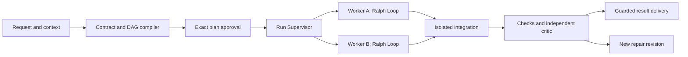

# Ralph

[English](README.md) · [한국어](README.ko.md)

**Graph-native local agent orchestration with isolated Ralph Loops and verifiable Git results.**


  [](https://github.com/worldclasscitizen/Ralph/actions/workflows/ci.yml) [](LICENSE)

## Quickstart

Ralph 0.3.0 targets Node.js 22 or 24 and Git. Install the published release:

```bash
npm install -g @worldclasscitizen/ralph@0.3.0
cd /absolute/path/to/a/clean/git-project
ralph init
ralph doctor
ralph plan "Create a small feature and verify it" --json
```

Review the returned graph, contract, provider candidates and budget. Copy its `runId`, then approve that exact saved plan:

```bash
ralph run --plan <run-id> --yes
ralph graph show <run-id> --format mermaid
ralph dashboard --open
```

Keep exported JSON outside the target working tree. Reviewed JSON may also be piped into `ralph run --plan-stdin --yes`. An unseen request with `--yes` is rejected. [First run](docs/getting-started.md)

## Loop and Graph

| Concern | v0.2 | v0.3 |
|---|---|---|
| History | Sequential loop run | One run, graph revisions and node generations |
| Workspace | Shared checkout | Separate worktree per writing node |
| Scheduling | Sequential roles | Dependency-ready tasks, bounded concurrency |
| Improvement | Global iteration | Local loop, at most six logical iterations |
| Recovery | Loop checkpoint | Hash-chained events, evidence and commit receipts |
| Result | Worker checkpoints | Independent final validation, guarded Git delivery |

## Architecture



Every revision remains acyclic. Worker iterations stay inside a node. Repair creates a new revision and preserves old evidence. Models propose work; TypeScript enforces scope, scheduling, budgets and completion. [Architecture](docs/architecture/index.md)

## Providers

CLI login and API-key connections have separate identities. Configure only what you use. DeepSeek and GLM can supply planning, work and evaluation; Codex is not mandatory.

```bash
ralph providers detect
ralph providers list
ralph auth status
ralph config refresh
```

<!-- provider-verification:start -->
| Connection / model | Support | Verified environment |
|---|---|---|
| Codex | compatible | Live release verification pending |
| Claude Code, Gemini CLI | compatible | Protocol tests; no current live verification |
| OpenAI, Anthropic, Gemini, DeepSeek, GLM APIs | compatible | Protocol tests; no current live verification |
| Antigravity | experimental | Requires a working automation interface |
| Other compatible endpoints | compatible | No live verification |
<!-- provider-verification:end -->

Installation, login and mock tests do not prove live conformance. Missing usage is unknown. Hard Pins never silently rotate. [Configuration and support evidence](docs/providers/index.md)

## Approval, stop and resume

```bash
ralph stop <run-id>
ralph resume <run-id>
ralph explain <run-id> --node work
ralph respond <run-id> --request <question-id> --stdin
```

Required answers never expire into consent. Noninteractive input requests use exit code 10. If the starting branch or user files changed, the result stays on `ralph/result-<run-id>`. T3 work requires final confirmation. No automatic push or deployment occurs.

## Dashboard

The packaged React dashboard has one entry per run, an ELK-layout graph, revision selection, model and iteration tags, an evidence inspector, invocation distributions and task-category counts. SSE resumes by event sequence. Commands require a local control token and matching Origin. [Dashboard and API](docs/dashboard/index.md)

## Status and limits

Ralph runs one local supervisor per project. Worktrees isolate changes but are not security sandboxes. Provider CLIs retain their own permissions. Unknown process outcomes and conflicts while assembling intermediate worker inputs stop for inspection. Final integration conflicts and failed final validation create a bounded repair revision. Worker context overflow retries with a shorter evidence-backed prompt that retains the contract; other roles pause when no safe compact context is available.

Remote execution, arbitrary conditional graphs, cost caps without accounting, and automatic handling of every conflict are outside version 0.3.0. Publication is checked against the [release gates](docs/project/v0.3-readiness.md).

## Documentation and contribution

- [Start here](START_HERE.md)
- [Architecture](docs/architecture/index.md)
- [Providers](docs/providers/index.md)
- [Dashboard](docs/dashboard/index.md)
- [v0.2 migration](docs/migration/v0.3.md)
- [CLI reference](docs/reference/cli.md)
- [Release readiness](docs/project/v0.3-readiness.md)

Before release, run `npm run build`, `npm test`, `npm run test:coverage`, `npm run test:e2e`, `npm run docs:check`, `npm run docs:build` and `npm run smoke`. Preserve evidence; do not claim unmeasured performance gains.
